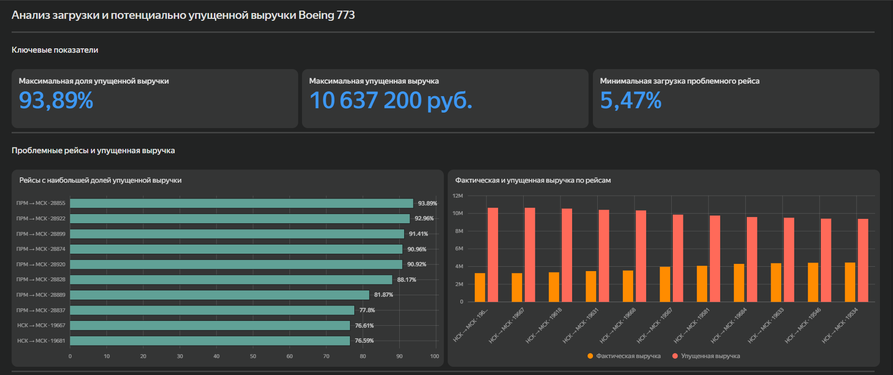
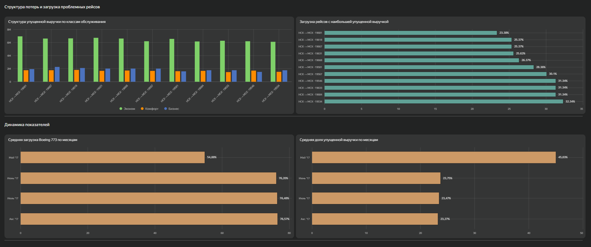

# Анализ загрузки и потенциально упущенной выручки Boeing 773

## О проекте

В этом проекте я исследовала данные об авиаперевозках. Сначала я сравнила типы самолётов по вместимости, загрузке и выручке, а затем заметила, что у части рейсов Boeing 773 загрузка была аномально низкой. После этого я подробнее проанализировала эти рейсы и оценила масштаб потенциально упущенной выручки.

## Что я анализировала

Для рейсов Boeing 773 я рассчитала:

- загрузку рейса;
- фактическую выручку;
- потенциально упущенную выручку и её долю;
- структуру потерь по классам обслуживания;
- средние показатели загрузки и потенциально упущенной выручки по маршрутам;
- динамику загрузки и доли потенциальных потерь по месяцам.

Также я выделила наиболее проблемные рейсы и проверила, повторяется ли проблема на уровне отдельных направлений.

## Методика

Загрузка рейса рассчитывалась как отношение количества проданных билетов к вместимости самолёта.

В данных Boeing 773 имеет 402 места:

- 324 — Economy;
- 48 — Comfort;
- 30 — Business.

Потенциально упущенную выручку я оценивала консервативно:

**количество непроданных мест × минимальная фактическая цена проданного билета соответствующего класса на конкретном рейсе.**

Минимальная цена использовалась, чтобы не завышать оценку потенциальной выручки.

Если по отдельному классу на рейсе не было ни одной продажи, фактическая цена для этого класса отсутствовала. В таком случае его вклад в расчёт потенциально упущенной выручки принимался равным **0 ₽**.

**Потенциально упущенная выручка в проекте — оценочная метрика, а не фактический финансовый убыток авиакомпании.**

## Основные результаты

На отдельных рейсах Boeing 773 доля потенциально упущенной выручки достигает **93,89%**, а максимальная сумма упущенной выручки на одном рейсе составляет **10,64 млн ₽**.

На наиболее проблемных рейсах больше всего потенциально упущенной выручки приходится на эконом-класс.

На уровне маршрутов проблема проявляется по-разному:

- **Пермь → Москва** — самая низкая средняя загрузка (**61,24%**) и самая высокая доля потерь относительно потенциальной выручки (**38,49%**);
- **Новосибирск → Москва** — самая высокая средняя потенциально упущенная выручка на один рейс — около **4,06 млн ₽**.

В мае средняя загрузка была ниже, а доля потенциальных потерь выше, чем в июне–августе. Однако май и август представлены неполными периодами, а доступных данных недостаточно, чтобы объяснить причины этой динамики.

## Ограничения

Период анализа — с **17.05.2017 по 15.08.2017**.

В доступных данных нет информации о внешних факторах, которые могли повлиять на загрузку и выручку: изменениях спроса, конкуренции, промо и других рыночных условиях.

В анализ включены только завершённые рейсы Boeing 773 со статусом `Arrived`.

## Дашборд

Для визуализации результатов я собрала интерактивный дашборд в Yandex DataLens.

В нём представлены:

- ключевые показатели;
- наиболее проблемные рейсы;
- сравнение фактической и потенциально упущенной выручки;
- структура по классам обслуживания;
- загрузка проблемных рейсов;
- динамика по месяцам;
- детализация по рейсам.

**Ссылка на дашборд:**  
[Открыть дашборд в Yandex DataLens](https://datalens.yandex/gdbrwt2g7smqz?_share_link=public)

## Данные

`data/boeing_773_analysis.csv` — итоговая витрина на уровне рейса, использованная для построения дашборда в DataLens.

## SQL

В папке `sql/` находятся основные этапы анализа:

- `01_exploration.sql` — первичное исследование данных;
- `02_boeing_773_analysis.sql` — основной расчёт показателей по рейсам Boeing 773;
- `03_route_analysis.sql` — анализ показателей на уровне маршрутов.

## Стек

PostgreSQL, SQL, DBeaver, Yandex DataLens